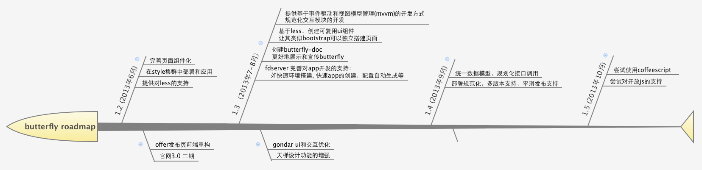

Butterfly规划和roadmap
======================

## 简介

butterfly专注于前端最佳解决方案，致力于成为前端的spring

它不仅仅是一些js模块，而是希望从多方面最佳地去解决前端开发上的问题，让我们可以快乐高效地开发产品。

它从四个方向去解决前端开发上的问题：

1. Framework
2. DPL
2. 工具和环境
3. 文档库

## Framework

Framework由许多js模块有机地组合在一起，主要是解决原生js太过自由不适合团队开发等缺点。

它主要从以下几个方面去解决并适应团队开发的

1. 模块规范化
2. 页面组件化
3. 事件驱动和视图模型管理
4. 丰富的UI组件和效果库组件
5. radiance app开发扩展

#### 目前现状

1. 模块规范化，效果库组件 等方面都已成型。
2. 页面组件化随着offer发布页改造的发布，也已完成。
3. radiance app开发的扩展也已在基于radiance的多个站点使用。

#### 后续计划

1\. 后续我们需要引入一种机制，解放和统一具体模块的开发，它是基于事件驱动和视图模型管理[mvvm](http://en.wikipedia.org/wiki/Model_View_ViewModel)。

具体方案会参考一些优秀的开源框架 AngularJs, batman 及knockout

2\. 统一数据模型，规范化接口调用(ajax/event/ascepter)

[参考]

[AngularJs](http://angularjs.org/)

[batmanjs](http://batmanjs.org/)

[knockout](http://knockoutjs.com/)

[mvvm](http://en.wikipedia.org/wiki/Model_View_ViewModel)

## DPL

DPL致力于提高页面的开发效率和质量，并期望统一页面元素的视觉和交互，最终达到快速搭建页面的目的。

#### 目前现状

目前我们主要完成了两个方面

1\. 布局和常见元素DPL化

目前完成的有: 布局，按扭，分页，对话框，tabs, 表格等

[buuterfly dpl](http://assets.1688.com/doc/index.htm#doc/dpl/index)

2\. 全站DPL(fui)的建设(目前进行中)

目前 butterfly dpl 建设已同全站 dpl建设(fui) 整合，即 fui 会以同样的规范应用于全站

后续会去除butterfly dpl，而直接使用fui来创建页面

[fui](http://wd.alibaba-inc.com/fdevlib/#fdui.com.tab)

#### 后续计划

引入less，以支持可参数化的动态DPL，创建高复用的ui组件

使用less，可以让css成为真正的编程语言，从页让“视觉”也变成组件

比如创建bootstrap的布局

	.makeGrid(@column: 12, @colwidth: 40, @margin: 30)

比如近两年流行的metro布局 [查看](http://veryless.org/examples/layout/metro/metro.html)

不需要关心css书写的一些细节了，因为复杂烦碎的工作只写一次便能重用

[参考]

[less](http://www.lesscss.net/)

[veryless](http://veryless.org/)

## 工具和环境

### fdserver

目前支持本地开发的jzsdk已升级成fdserver, 以支持全站前端的开发。

fdserver是基于nodejs connect模块以中间件的方式开发的，所以很容易扩展。

#### 目前状况

可以看在线项目介绍

[https://github.com/fangdeng/fdserver](https://github.com/fangdeng/fdserver)

#### 后续计划

1. fdlint的扫描。用于在开发时实时检测代码是否符合规划，找出潜在问题。
2. app开发的支持
	(1) 快速环境搭建
	(2) app配置的自动生成
	(3) app创建时，自动创建模板代码，以简化开发
4. 引入各种插件来简化本地的开发

### 发布和部署

#### 目前状况

1. offer发布页等使用的是中文站style环境，走Aone自主发布
2. 旺铺等radiance应用使用的是基于tengine的static环境，自主发布

#### 后续计划

1\. 首先需要一种规范来解决双方维护和升级上的问题，即能保证两者能够独立升级，又能保持版本上的相对一致性。

目前方案是使用svn external分支及适当的规范来达到这个目的

2\. 后续需要统一style环境和static环境
 
 计划是改成git管理，并迁移到gondar环境进行发布。

 并同fdserver整合，并引入组件多版本机制，彻底解决平滑发布，缓存等问题。

## 文档 (butterfly-doc)

#### 目前状况

radiance和butterfly经过一年的发展，也有一些文档沉淀，但比较分散

主要有：

1. [radiance &amp; app开发文档](http://doc.site.alibaba-inc.com)
2. [butterfly api](http://assets.1688.com)

#### 后续计划

建立buttefly的官方站点 butterfly-doc

原因：

1. butterfly目前没在线宣传站点
2. 计划添加“开发字典”，以沉淀非组件形式的“软经验“。如规范，一类问题的最佳解决方案等。
3. 希望整合所有文档，并且让文档也成为一种产品，以解决文档和代码脱离的问题。

*项目地址:*

[https://github.com/bencode/butterfly-doc](https://github.com/bencode/butterfly-doc)

#### 技术基础
1. 基于nodejs，以express为基础框架，搭建web应用
2. 以git作为持久化存储，天然具有多版本功能

#### 功能
1. butterfly api浏览及更改
2. demo和在线示例的创建
3. radiance &amp; app开发文档的浏览和更改

## 新技术的引入

在具体版本演化过程中，以下新技术也会被考虑

### Coffeescript

团队开发更需要使用javascript的good part，而避开一些陷阱

因此会在发布系统完善后，引入coffeescript来支持更爽的javascript开发

### 开放javascript

由于业务和技术上还不够成熟的原因，目前尚未对设计师开放javascript，

我们的autowire功能让设计师也可以很好地使用动态组件，这从一定程度上缓解了这种需求。

但在技术上开放javascript是可行的，采用和coffeescript同样的编译技术， 只是现在是把javascript编译并转化成”安全”的javascript代码。

后续我们会先在技术上做好开放javascript的准备。

[参考]

[coffeescript.org](http://coffeescript.org/)

## Roadmap

